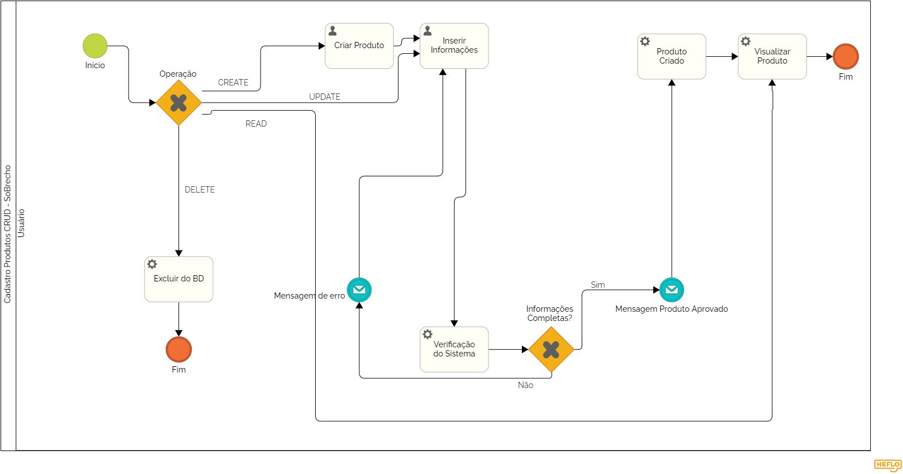

# 3.3.2 Processo 2 – Cadastro de Peças

O processo de cadastro de peças permite que vendedores adicionem, editem, visualizem e excluam peças no sistema. Ele garante que todas as informações obrigatórias estejam preenchidas corretamente antes da publicação.

## Oportunidades de Melhoria
- Implementação de feedback detalhado para erros de cadastro.
- Automação do envio de notificações ao vendedor em caso de erro.
- Interface mais intuitiva para evitar preenchimentos incorretos.

## Modelo BPMN do Processo 2

---

## Detalhamento das Atividades

### 1. Escolher Operação
O usuário pode escolher entre **criar**, **atualizar**, **visualizar** ou **excluir** uma peça.

- **CREATE** → Vai para *Criar Produto*.
- **UPDATE** → Vai para *Inserir Informações*.
- **READ** → Vai para *Visualizar Produto*.
- **DELETE** → Vai para *Excluir do BD*.

---

### 2. Criar Produto
O vendedor insere os dados básicos da peça, como nome, descrição, preço e categoria.

| **Campo**        | **Tipo**        | **Restrições**                     | **Valor default** |
|-----------------|----------------|----------------------------------|------------------|
| Nome da peça    | Caixa de texto  | Obrigatório, mínimo 3 caracteres | -                |
| Descrição       | Área de texto   | Obrigatório, mínimo 10 caracteres | -                |
| Preço           | Número          | Obrigatório, maior que zero      | -                |
| Categoria       | Seleção única   | Obrigatório, opções predefinidas | -                |

**Comandos:**
- **Salvar** → *Verificação do sistema* (default)

---

### 3. Upload de Imagens da Peça
O vendedor adiciona imagens ilustrativas da peça.

| **Campo**  | **Tipo**  | **Restrições**                 | **Valor default** |
|-----------|----------|-----------------------------|------------------|
| Imagem 1  | Imagem   | Obrigatório, formato JPG/PNG | -                |
| Imagem 2  | Imagem   | Opcional, formato JPG/PNG   | -                |

**Comandos:**
- **Enviar** → *Verificação do sistema* (default)

---

### 4. Verificação do Sistema
O sistema valida se todas as informações e imagens foram preenchidas corretamente. Se houver erro, envia uma mensagem ao vendedor.

| **Campo**            | **Tipo**        | **Restrições**        | **Valor default** |
|---------------------|---------------|--------------------|------------------|
| Status de verificação | Seleção única | Aprovado/Reprovado | -                |

**Comandos:**
- **Sim** → *Mensagem Produto Aprovado*.
- **Não** → *Mensagem de erro*.

---

### 5. Mensagem de Erro
Se houver erro no cadastro, o sistema notifica o vendedor para correção.

| **Campo**           | **Tipo**      | **Restrições** | **Valor default** |
|--------------------|-------------|--------------|------------------|
| Descrição do erro | Área de texto | Obrigatório | -                |

**Comandos:**
- **Corrigir** → *Inserir informações da peça* (default)
- **Não corrigir** → *Fim* (cancel)

---

### 6. Mensagem Produto Aprovado
Se todas as informações estiverem corretas, o sistema aprova a peça e envia uma notificação ao vendedor.

| **Campo**              | **Tipo**      | **Restrições** | **Valor default** |
|-----------------------|-------------|--------------|------------------|
| Mensagem de aprovação | Área de texto | Obrigatório | "Sua peça foi aprovada!" |

**Comandos:**
- **Confirmar** → *Produto Criado*.

---

### 7. Produto Criado
A peça é adicionada ao banco de dados e pode ser visualizada.

**Comandos:**
- **Visualizar Produto** → *Visualizar Produto*.
- **Finalizar** → *Fim*.

---

### 8. Visualizar Produto
O usuário pode visualizar os detalhes do produto criado.

**Comandos:**
- **Finalizar** → *Fim*.

---

### 9. Excluir do BD
Se o usuário escolheu **DELETE**, o sistema remove a peça do banco de dados.

**Comandos:**
- **Fim** → Processo encerrado.

---

Esse detalhamento garante um entendimento completo do processo de cadastro de peças no **SóBrecho**, conforme representado no diagrama BPMN.
