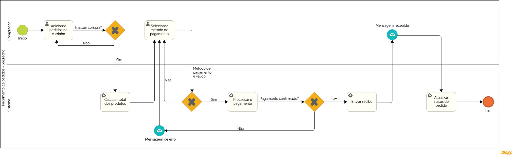

### 3.3.3 Processo 3 – PAGAMENTO DE PEDIDOS

#### Detalhamento das atividades

O processo 3 tem como prioridade a implementação do sistema de pagamentos funcional, capaz de reconhecer a forma de pagamento selecionada pelo cliente, confirmar a compra e enviar um recibo para o cliente

**1. Adicionar pedidos no carrinho**
Descrição: O comprador seleciona os produtos desejados e os adiciona ao carrinho de compras.
Tipos de dados utilizados:
    Tabela (para armazenar os produtos no carrinho)
    Número (quantidade de cada produto)

**2. Finalizar compra?**
Descrição: O comprador decide se deseja prosseguir com o pagamento ou continuar adicionando produtos ao carrinho.
Tipos de dados utilizados:
  Seleção única (Sim/Não)

**3. Calcular total dos produtos**
Descrição: O sistema soma o valor total dos produtos no carrinho e exibe o montante final.
Tipos de dados utilizados:
  Número (valor total calculado)

**4. Selecionar método de pagamento**
Descrição: O comprador escolhe um método de pagamento disponível (cartão de crédito, boleto, PIX, etc.).
Tipos de dados utilizados:
  Seleção única (opções de pagamento)

**5. Método de pagamento é válido?**
Descrição: O sistema verifica se o método de pagamento selecionado é válido e aceito.
Tipos de dados utilizados:
  Seleção única (Sim/Não)
  Caixa de texto (mensagem de erro, caso inválido)

**6. Processar o pagamento**
Descrição: Se o método de pagamento for válido, o sistema realiza a transação financeira.
Tipos de dados utilizados:
  Número (valor da transação)
  Data e Hora (momento da transação)

7. Pagamento confirmado?
Descrição: O sistema verifica se o pagamento foi aprovado pela instituição financeira.
Tipos de dados utilizados:
  Seleção única (Sim/Não)

**8. Enviar recibo**
Descrição: Se o pagamento for confirmado, o sistema gera e envia um recibo ao comprador.
Tipos de dados utilizados:
  Arquivo (recibo em PDF)
  Link (acesso ao recibo)

**9. Atualizar status do pedido**
Descrição: O sistema altera o status do pedido para "Pagamento Confirmado" e atualiza o histórico do comprador.
Tipos de dados utilizados:
  Caixa de texto (status do pedido)
  Data e Hora (atualização do status)

**10. Mensagem recebida**
Descrição: O comprador recebe uma notificação sobre o status do pagamento.
Tipos de dados utilizados:
  Área de texto (mensagem de confirmação ou erro)

**11. Mensagem de erro (se houver problema no pagamento)**
Descrição: Caso o pagamento não seja aprovado, o sistema envia uma mensagem informando o erro e solicitando nova tentativa.
Tipos de dados utilizados:
  Área de texto (descrição do erro)

**Adicionar pedidos no carrinho**

| **Campo**       | **Tipo**         | **Restrições** | **Valor default** |
| [Preço unitário]|    [Número]      | Maior que zero | ---               |
[Finalizar compra]|[Seleção múltipla]| Obrigatorio    | ----              |
| [Quantidade]    |   [Número]       | Maior que 1    |  1                |
| [Total parcial] |[Número]          |Soma automática dos produtos |      |

| **Comandos**         |  **Destino**                   | **Tipo** |
| [Continuar comprando]|  Adicionar pedidos ao carrinho | (default)         |
| [Finalizar compra]   | Finalizar compra?              | (default)         |

**Nome da atividade 2**

| **Campo**       | **Tipo**         | **Restrições** | **Valor default** |
| ---             | ---              | ---            | ---               |
| [Nome do campo] | [tipo de dados]  |                |                   |
|                 |                  |                |                   |

| **Comandos**         |  **Destino**                   | **Tipo**          |
| ---                  | ---                            | ---               |
| [Nome do botão/link] | Atividade/processo de destino  | (default/cancel/  ) |
|                      |                                |                   |
