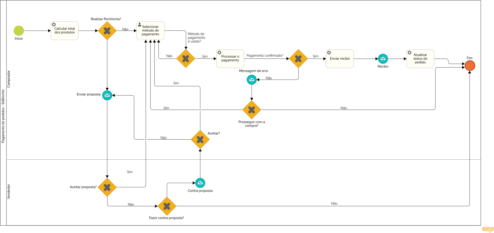

### 3.3.3 Processo 3 – PAGAMENTO DE PEDIDOS

#### Detalhamento das atividades

O processo 3 tem como prioridade a implementação do sistema de pagamentos funcional, capaz de reconhecer a forma de pagamento selecionada pelo cliente, confirmar a compra e enviar um recibo para o cliente

# Detalhamento das Atividades - Pagamento de Pedidos

## 1. Adicionar pedidos no carrinho

| **Campo**       | **Tipo**         | **Restrições**          | **Valor default** |
|----------------|----------------|------------------------|-------------------|
| Produto        | Seleção múltipla | Obrigatório             | -                 |
| Quantidade    | Número           | Mínimo 1 unidade        | 1                 |
| Preço unitário | Número           | Maior que zero          | -                 |
| Total parcial  | Número           | Soma automática         | -                 |

| **Comandos**         | **Destino**                    | **Tipo**   |
|----------------------|------------------------------|-----------|
| Continuar comprando  | Adicionar pedidos no carrinho | default    |
| Finalizar compra     | Finalizar compra?             | default    |

---

## 2. Finalizar compra?

| **Campo**  | **Tipo**        | **Restrições** | **Valor default** |
|------------|---------------|---------------|-------------------|
| Escolha    | Seleção única  | Obrigatório   | -                 |

| **Comandos**         | **Destino**                    | **Tipo**   |
|----------------------|--------------------------------|-----------|
| Sim                  | Calcular total dos produtos   | default    |
| Não                  | Adicionar pedidos no carrinho | cancel     |

---

## 3. Calcular total dos produtos

| **Campo**     | **Tipo**  | **Restrições**            | **Valor default** |
|--------------|---------|------------------------|-------------------|
| Valor total  | Número  | Somar valores dos produtos | -                 |

| **Comandos**         | **Destino**                     | **Tipo**   |
|----------------------|--------------------------------|-----------|
| Selecionar pagamento | Selecionar método de pagamento | default    |

---

## 4. Selecionar método de pagamento

| **Campo**             | **Tipo**        | **Restrições** | **Valor default** |
|----------------------|---------------|---------------|-------------------|
| Método de pagamento  | Seleção única  | Obrigatório   | -                 |

| **Comandos**         | **Destino**                    | **Tipo**   |
|----------------------|--------------------------------|-----------|
| Confirmar            | Método de pagamento é válido? | default    |
| Cancelar             | Adicionar pedidos no carrinho | cancel     |

---

## 5. Método de pagamento é válido?

| **Campo**       | **Tipo**        | **Restrições** | **Valor default** |
|----------------|---------------|---------------|-------------------|
| Validação     | Seleção única  | Sim ou Não    | -                 |

| **Comandos**         | **Destino**               | **Tipo**   |
|----------------------|--------------------------|-----------|
| Sim                  | Processar o pagamento    | default    |
| Não                  | Mensagem de erro         | default    |

---

## 6. Processar o pagamento

| **Campo**    | **Tipo**       | **Restrições**            | **Valor default** |
|------------|-------------|------------------------|-------------------|
| Valor pago  | Número     | Igual ao valor total  | -                 |
| Data e hora | Data e Hora | Registro automático  | -                 |

| **Comandos**         | **Destino**                      | **Tipo**   |
|----------------------|--------------------------------|-----------|
| Confirmar pagamento  | Pagamento confirmado?           | default    |
| Cancelar             | Selecionar método de pagamento  | cancel     |

---

## 7. Pagamento confirmado?

| **Campo**   | **Tipo**       | **Restrições** | **Valor default** |
|------------|-------------|---------------|-------------------|
| Status     | Seleção única  | Sim ou Não   | -                 |

| **Comandos**         | **Destino**           | **Tipo**   |
|----------------------|----------------------|-----------|
| Sim                  | Enviar recibo         | default    |
| Não                  | Mensagem de erro      | default    |

---

## 8. Enviar recibo

| **Campo**   | **Tipo**  | **Restrições**       | **Valor default** |
|------------|---------|-------------------|-------------------|
| Recibo     | Arquivo  | Gerado automaticamente | -                 |

| **Comandos**         | **Destino**                  | **Tipo**   |
|----------------------|----------------------------|-----------|
| OK                   | Atualizar status do pedido  | default    |

---

## 9. Atualizar status do pedido

| **Campo**    | **Tipo**        | **Restrições** | **Valor default** |
|------------|--------------|---------------|-------------------|
| Status     | Seleção única | Pago          | -                 |

| **Comandos**         | **Destino**  | **Tipo**   |
|----------------------|-------------|-----------|
| Finalizar            | Fim         | default    |

---

## 10. Mensagem de erro

| **Campo**     | **Tipo**  | **Restrições**       | **Valor default** |
|-------------|---------|-------------------|-------------------|
| Mensagem    | Área de texto | Automática        | -                 |

| **Comandos**         | **Destino**                     | **Tipo**   |
|----------------------|------------------------------|-----------|
| Tentar novamente     | Selecionar método de pagamento | default    |

---
