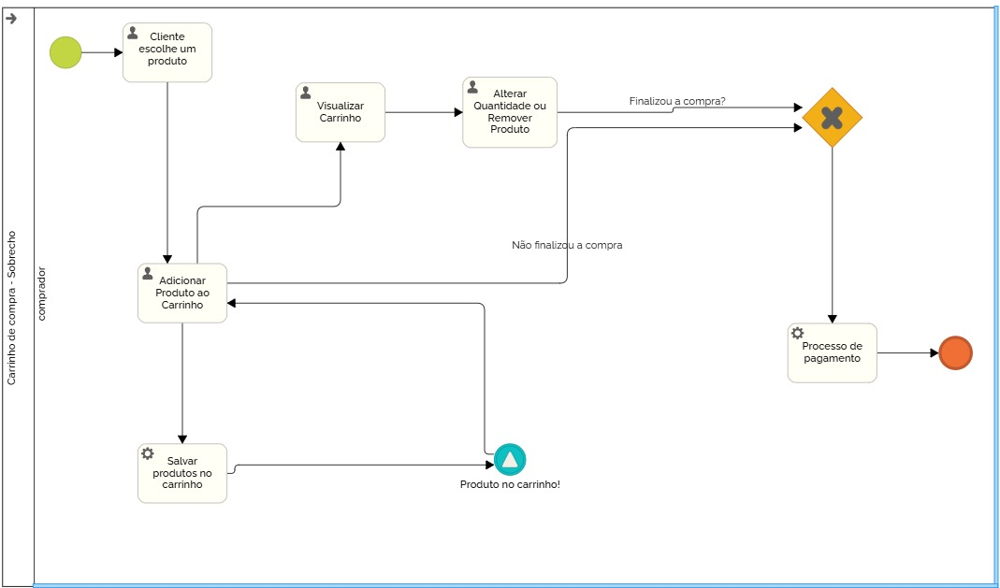

# 3.3.4 Processo 4 – Carrinho de Compras

Apresenta-se o processo de Carrinho de Compras, um processo essencial no ciclo de compra online. Este processo possibilita ao usuário adicionar itens ao carrinho, visualizar e modificar as quantidades, aplicar cupons de desconto e finalizar a compra. O modelo BPMN apresentado a seguir descreve as principais etapas deste processo.

## Oportunidades de Melhoria
- Implementação de sugestões de produtos complementares no carrinho.
- Exibição dinâmica de descontos ao adicionar cupons.
- Interface mais intuitiva para modificação de quantidades e remoção de itens.

## Modelo BPMN do Processo 1

---

## Detalhamento das Atividades

### 1. Adicionar Produto ao Carrinho
O usuário seleciona um produto para adicionar ao carrinho de compras.

| **Campo**          | **Tipo**         | **Restrições**                          | **Valor default** |
|--------------------|-----------------|------------------------------------------|------------------|
| Nome do Produto   | Caixa de Texto   | Formato de texto livre                   | -                |
| Quantidade        | Número           | Valor mínimo: 1, valor máximo: 99       | 1                |
| Preço             | Número           | Somente valores numéricos                | -                |
| Tamanho          | Seleção Única    | Opções: Pequeno, Médio, Grande         | -                |
| Cor              | Seleção Única    | Opções: diversas cores                  | -                |
| Imagem do Produto | Imagem           | Formato de imagem .jpg ou .png          | -                |

**Comandos:**  
- **Adicionar ao Carrinho** → *Página de Carrinho de Compras* (default)  
- **Continuar Comprando** → *Página de Produtos* (default)  
- **Finalizar Compra** → *Página de Finalização de Compra* (default)  

---

### 2. Visualizar Carrinho de Compras
O usuário pode visualizar os produtos adicionados ao carrinho e modificar quantidades ou remover itens.

| **Campo**          | **Tipo**       | **Restrições**                          | **Valor default** |
|--------------------|---------------|------------------------------------------|------------------|
| Nome do Produto   | Caixa de Texto | Somente leitura (campo não editável)    | -                |
| Quantidade        | Número         | Valor mínimo: 1, valor máximo: 99       | -                |
| Preço             | Número         | Somente leitura (campo não editável)    | -                |
| Total            | Número         | Somente leitura (campo não editável)    | -                |
| Imagem do Produto | Imagem         | Somente leitura (campo não editável)    | -                |

**Comandos:**  
- **Remover Produto** → *Página de Carrinho de Compras* (default)  
- **Continuar Comprando** → *Página de Produtos* (default)  
- **Finalizar Compra** → *Página de Finalização de Compra* (default)  

---

### 3. Finalizar Compra
O usuário preenche os detalhes necessários para concluir a compra.

| **Campo**           | **Tipo**        | **Restrições**                          | **Valor default** |
|---------------------|----------------|------------------------------------------|------------------|
| Endereço de Entrega | Área de Texto  | Máximo 200 caracteres                   | -                |
| Data de Entrega    | Data           | Data mínima: 1 dia após a compra        | -                |
| Total Final       | Número         | Somente leitura (campo não editável)    | -                |

**Comandos:**  
- **Confirmar Compra** → *Página de Confirmação de Compra* (default)  
- **Cancelar Compra** → *Página de Carrinho de Compras* (cancel)  

---

Esse detalhamento garante um entendimento completo do processo de **Carrinho de Compras**, conforme representado no diagrama BPMN.
