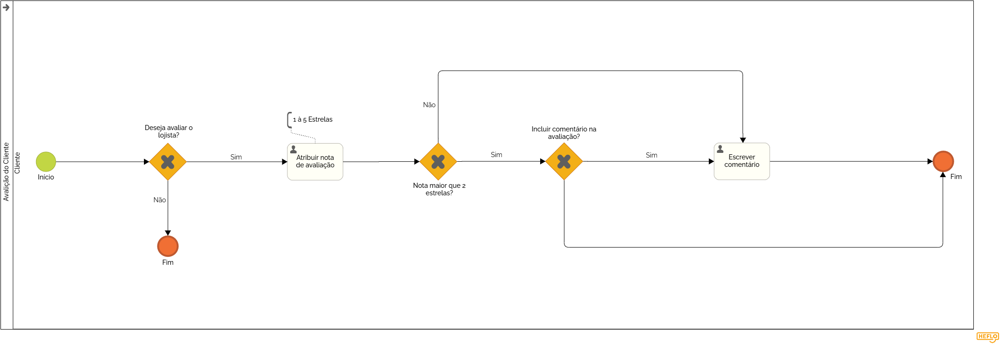

# 3.3.4 Processo 4 – Avaliação de Cliente 

O processo de avaliação de clientes permite que lojistas atribuam uma nota ao cliente após um atendimento. Caso a nota seja menor ou igual a 2 estrelas, um comentário se torna obrigatório antes de finalizar a avaliação. 

## Oportunidades de Melhoria 
- Implementação de feedback mais detalhado sobre a avaliação. 
- Integração de um sistema de alertas para clientes com avaliações baixas recorrentes. 
- Interface mais intuitiva para a atribuição de notas e comentários. 

## Modelo BPMN do Processo 4
 

---

## Detalhamento das Atividades 

### 1. Realizar Atendimento 
O lojista realiza o atendimento ao cliente antes de prosseguir com a avaliação. 

| **Campo**                | **Tipo**       | **Restrições** | **Valor default** |
|--------------------------|----------------|----------------|-------------------|
| Descrição do Atendimento | Área de texto  | Obrigatório    | -                 |

**Comandos:**  
- **Finalizar Atendimento** → *Gateway "Deseja avaliar o cliente?"* (default): redireciona o sistema para o passo de avaliação, abrindo a interface de atribuição de nota.  
- **Cancelar** → *Tela inicial do sistema* (cancel): permite ao lojista cancelar o atendimento e retornar ao menu principal.  

---

### 2. Atribuir Nota de Avaliação 
O lojista escolhe uma nota de 1 a 5 estrelas para avaliar o cliente. 

| **Campo** | **Tipo** | **Restrições**               | **Valor default** |
|----------|----------|------------------------------|-------------------|
| Nota     | Número   | Obrigatório (1 a 5 estrelas) | -                 |

**Comandos:**  
- **Confirmar Nota** → *Gateway "Nota maior que 2 estrelas?"* (default): caso a nota seja maior que 2, avança diretamente para o registro da avaliação. Se for menor ou igual a 2, direciona para o campo obrigatório de comentário.  
- **Cancelar Avaliação** → *Tela de Atendimento* (cancel): cancela o processo de avaliação, retornando à tela anterior.  

---

### 3. Escrever Comentário *(Obrigatório caso a nota seja menor ou igual a 2 estrelas)* 
Se a nota atribuída for **≤ 2**, o lojista deve obrigatoriamente inserir um comentário justificando a avaliação. 

| **Campo**  | **Tipo**      | **Restrições**                | **Valor default** |
|------------|---------------|-------------------------------|-------------------|
| Comentário | Área de texto | Obrigatório se nota ≤ 2       | -                 |

**Comandos:**  
- **Enviar Comentário** → *Gateway "Incluir comentário na avaliação?"* (default): após validação do comentário, permite avançar para o registro da avaliação.  
- **Cancelar Avaliação** → *Tela de Atendimento* (cancel): cancela o processo e retorna ao início do atendimento.  

---

### 4. Registrar Avaliação no Sistema 
Após a atribuição da nota e possível inclusão do comentário, a avaliação é registrada no sistema. 

| **Campo**        | **Tipo**      | **Restrições** | **Valor default** |
|------------------|---------------|----------------|-------------------|
| Avaliação Salva  | Confirmação   | Obrigatório    | -                 |

**Comandos:**  
- **Finalizar** → *Fim do Processo* (default): exibe mensagem de sucesso e redireciona o usuário para a tela inicial ou próxima atividade.  
- **Visualizar Histórico** → *Tela de Histórico de Avaliações* (opcional): permite ao lojista consultar avaliações anteriores feitas ao cliente.  

---

Esse detalhamento garante um entendimento completo do processo de **Avaliação de Cliente**, conforme representado no diagrama BPMN.
