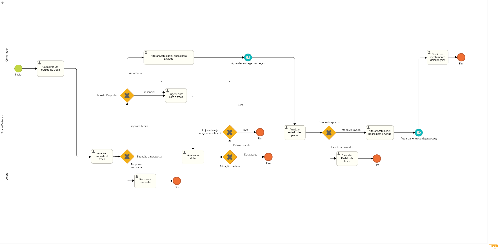

### 3.3.5 Processo 4 – Troca de Peças

#### Detalhamento das atividades

**Cadastrar uma peça para troca**

| **Campo**       | **Tipo**         | **Restrições** | **Valor default** |
| ---             | ---              | ---            | ---               |
| Nome da peça    | Caixa de Texto   | máximo de 100 caracteres |         |
| Descrição       | Caixa de Texto   | Máximo de 500 caracteres |         |
| Foto da peça    | Arquivo          | Apenas arquivos png e jpeg |       |
| Brechó   | Seleção única | Um dos brechós cadastrados na plataforma |   |
| Peça desejada   | Seleção única | Uma das peças do brechó selecionado | |

| **Comandos**         |  **Destino**                   | **Tipo** |
| ---                  | ---                            | ---      |
| Cadastrar            | Cadastrar Proposta de troca  |            |

**Analisar Proposta de Troca**

| **Comandos**         |  **Destino**                   | **Tipo**          |
| ---                  | ---                            | ---               |
| Aceitar | Proposta Aceita  | (default/accept/  )                          |
| Recusar | Proposta Recusada  | (default/cancel/  )                        |

**Sugerir data para a troca**

| **Campo**       | **Tipo**         | **Restrições** | **Valor default** |
| ---             | ---              | ---            | ---               |
| Data/Hora da troca | Data e Hora | Tem que ser um dia no futuro |       |

| **Comandos**         |  **Destino**                   | **Tipo** |
| ---                  | ---                            | ---      |
| Enviar proposta      | Envia proposta para análise  |            |

**Analisar Data Sugerida**

| **Comandos**         |  **Destino**                   | **Tipo**          |
| ---                  | ---                            | ---               |
| Aceitar | Proposta Aceita  | (default/accept/  )                          |
| Recusar | Proposta Recusada  | (default/cancel/  )                        |
| Recusar e Reagendar | Proposta Recusada  | (default/cancel/  )            |

**Atualizar estado da(s) peça(s)**

| **Comandos**         |  **Destino**                   | **Tipo**          |
| ---                  | ---                            | ---               |
| Aprovar | Itens Aceitos/Seguir para o envio  | (default/accept/  )        |
| Reprovar | Cancelar Proposta de Troca  | (default/cancel/  )              |

**Alterar Status da(s) peça(s) para Enviado**

| **Comandos**         |  **Destino**                   | **Tipo**          |
| ---                  | ---                            | ---               |
| Confirmar Envio | Confirma Envio | (default/accept/  )                    |

**Cancelar Pedido de Troca**

| **Comandos**         |  **Destino**                   | **Tipo**          |
| ---                  | ---                            | ---               |
| Reprovar | Cancelar Proposta de Troca  | (default/cancel/  )              |

**Confirmar recebimento da(s) peça(s)**

| **Comandos**         |  **Destino**                   | **Tipo**          |
| ---                  | ---                            | ---               |
| Confirmar | Finalizar Troca | (default/accept/  )                         |
