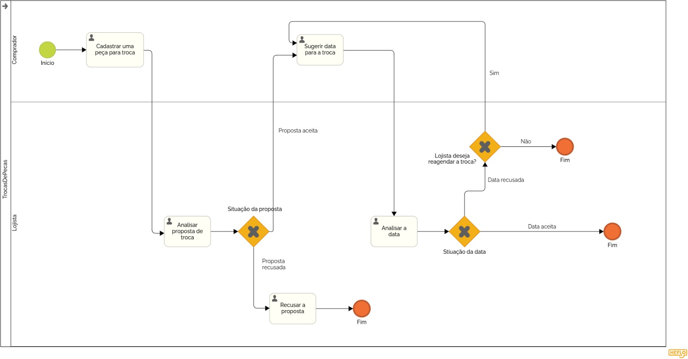

### 3.3.4 Processo 4 – Troca de Peças

#### Detalhamento das atividades

_Descreva aqui cada uma das propriedades das atividades do processo 4. 
Devem estar relacionadas com o modelo de processo apresentado anteriormente._

_Os tipos de dados a serem utilizados são:_

_* **Área de texto** - campo texto de múltiplas linhas_

_* **Caixa de texto** - campo texto de uma linha_

_* **Número** - campo numérico_

_* **Data** - campo do tipo data (dd-mm-aaaa)_

_* **Hora** - campo do tipo hora (hh:mm:ss)_

_* **Data e Hora** - campo do tipo data e hora (dd-mm-aaaa, hh:mm:ss)_

_* **Imagem** - campo contendo uma imagem_

_* **Seleção única** - campo com várias opções de valores que são mutuamente exclusivas (tradicional radio button ou combobox)_

_* **Seleção múltipla** - campo com várias opções que podem ser selecionadas mutuamente (tradicional checkbox ou listbox)_

_* **Arquivo** - campo de upload de documento_

_* **Link** - campo que armazena uma URL_

_* **Tabela** - campo formado por uma matriz de valores_

**Cadastrar uma peça para troca**

| **Campo**       | **Tipo**         | **Restrições** | **Valor default** |
| ---             | ---              | ---            | ---               |
| Nome da peça    | Caixa de Texto   | máximo de 100 caracteres |         |
| Descrição       | Caixa de Texto   | Máximo de 500 caracteres |         |
| Foto da peça    | Arquivo          | Apenas arquivos png e jpeg |       |
| Brechó   | Seleção única | Um dos brechós cadastrados na plataforma |   |
| Peça desejada   | Seleção única | Uma das peças do brechó selecionado | |

| **Comandos**         |  **Destino**                   | **Tipo** |
| ---                  | ---                            | ---      |
| Cadastrar            | Cadastrar Proposta de troca  |            |

**Analisar Proposta de Troca**

| **Comandos**         |  **Destino**                   | **Tipo**          |
| ---                  | ---                            | ---               |
| Aceitar | Proposta Aceita  | (default/accept/  )                          |
| Recusar | Proposta Recusada  | (default/cancel/  )                        |

**Sugerir data para a troca**

| **Campo**       | **Tipo**         | **Restrições** | **Valor default** |
| ---             | ---              | ---            | ---               |
| Data/Hora da troca | Data e Hora | Tem que ser um dia no futuro |       |

| **Comandos**         |  **Destino**                   | **Tipo** |
| ---                  | ---                            | ---      |
| Enviar proposta      | Envia proposta para análise  |            |

**Analisar Data Sugerida**

| **Comandos**         |  **Destino**                   | **Tipo**          |
| ---                  | ---                            | ---               |
| Aceitar | Proposta Aceita  | (default/accept/  )                          |
| Recusar | Proposta Recusada  | (default/cancel/  )                        |
| Recusar e Reagendar | Proposta Recusada  | (default/cancel/  )            |
