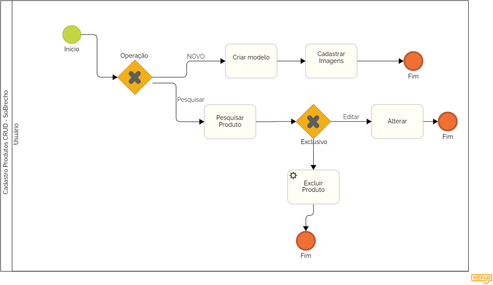

# 3.3.4 Processo 4 – Gestão de Produtos

## Modelo BPMN do Processo 1

---

## Detalhamento das Atividades

### 1. Criar Produto
O usuário seleciona um produto para adicionar ao carrinho de compras.

| **Campo**          | **Tipo**         | **Restrições**                          | **Valor default** |
|--------------------|-----------------|------------------------------------------|------------------|
| Nome do Produto   | Caixa de Texto   | Formato de texto livre                   | -                |
| Quantidade        | Número           | Valor mínimo: 1, valor máximo: 99       | 1                |
| Preço             | Número           | Somente valores numéricos                | -                |
| Tamanho          | Seleção Única    | Opções: Pequeno, Médio, Grande         | -                |
| Cor              | Seleção Única    | Opções: diversas cores                  | -                |
| Imagem do Produto | Imagem           | Formato de imagem .jpg ou .png          | -                |

**Comandos:**  
- **Criar Produto** → *Página de Criação de produto* (default)  

---

### 2. Visualizar/Editar Produto
O usuário pode visualizar os produtos criados e modificar.

| **Campo**          | **Tipo**         | **Restrições**                          | **Valor default** |
|--------------------|-----------------|------------------------------------------|------------------|
| Nome do Produto   | Caixa de Texto   | Formato de texto livre                   | -                |
| Quantidade        | Número           | Valor mínimo: 1, valor máximo: 99       | 1                |
| Preço             | Número           | Somente valores numéricos                | -                |
| Tamanho          | Seleção Única    | Opções: Pequeno, Médio, Grande         | -                |
| Cor              | Seleção Única    | Opções: diversas cores                  | -                |
| Imagem do Produto | Imagem           | Formato de imagem .jpg ou .png          | -                |

**Comandos:**  
- **Visualizar Produto** → *Página de Visualizar* (default)  
- **Editar Produto** → *Página de Alteracao* (default)  
---

### 3. Excluir Produto
O usuário exclui o produto desejado.

| **Campo**          | **Tipo**         | **Restrições**                          | **Valor default** |
|--------------------|-----------------|------------------------------------------|------------------|
| Nome do Produto   | Caixa de Texto   | Formato de texto livre                   | -                |
| Quantidade        | Número           | Valor mínimo: 1, valor máximo: 99       | 1                |
| Preço             | Número           | Somente valores numéricos                | -                |
| Tamanho          | Seleção Única    | Opções: Pequeno, Médio, Grande         | -                |
| Cor              | Seleção Única    | Opções: diversas cores                  | -                |
| Imagem do Produto | Imagem           | Formato de imagem .jpg ou .png          | -                |

**Comandos:**  
- **Excluir Produto** → *Página de Excluir Produto* (default)  

---

Esse detalhamento garante um entendimento completo do processo de **Gestao de Produtos**, conforme representado no diagrama BPMN.
